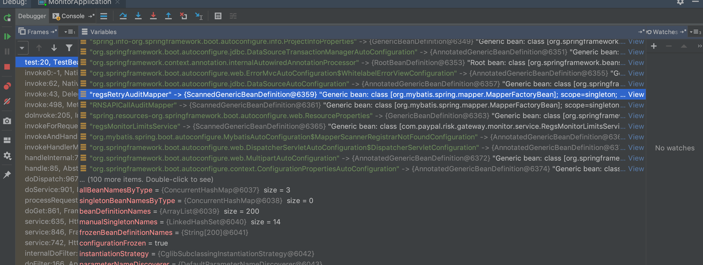

# mybatis 原理分析 —— 正面入手
{docsify-updated}


今天我们从正面入手，来一探 Mybatis 的究竟。话不多说，看下图：


注意到：我们写的 `@Mapper` 接口，在 Spring 中注册的 bean 的实际类型是 `MapperFactoryBean` .这是如何做到的呢？有个疑问：
+ 如何实现自定义注解的（`@Mapper`） bean 注册 ？（ `ClassPathMapperScanner` ）
这个疑问后续可以研究，今天暂时忽略。

`MapperFactoryBean` 实现了 `FactoryBean` 接口，因此，我们在使用 `@Mapper` 接口时，实际上获取的是 `MapperFactoryBean` 对象的 `getObject()` 方法返回的对象：

```
MapperFactoryBean 类：

/**
* {@inheritDoc}
*/
@Override
public T getObject() throws Exception {
return getSqlSession().getMapper(this.mapperInterface);
}

——>

MapperRegistry类：

public <T> T getMapper(Class<T> type, SqlSession sqlSession) {
final MapperProxyFactory<T> mapperProxyFactory = (MapperProxyFactory<T>) knownMappers.get(type);
if (mapperProxyFactory == null) {
    throw new BindingException("Type " + type + " is not known to the MapperRegistry.");
}
try {
    return mapperProxyFactory.newInstance(sqlSession);
} catch (Exception e) {
    throw new BindingException("Error getting mapper instance. Cause: " + e, e);
}
}

——>

MapperProxyFactory 类：

@SuppressWarnings("unchecked")
protected T newInstance(MapperProxy<T> mapperProxy) {
return (T) Proxy.newProxyInstance(mapperInterface.getClassLoader(), new Class[] { mapperInterface }, mapperProxy);
}

public T newInstance(SqlSession sqlSession) {
final MapperProxy<T> mapperProxy = new MapperProxy<T>(sqlSession, mapperInterface, methodCache);
return newInstance(mapperProxy);
}
```

从上述代码中终于可以看出：我们使用 `@Mapper` 接口时，实际上获取的是个动态代理对象。