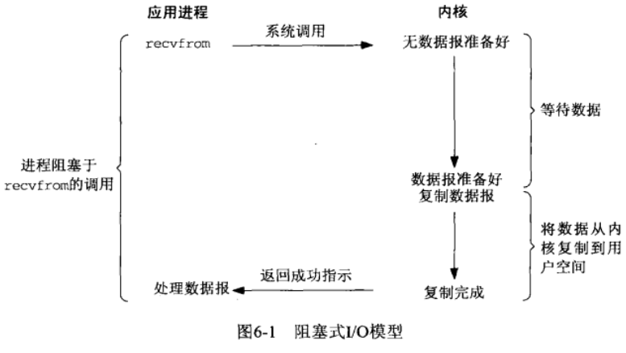
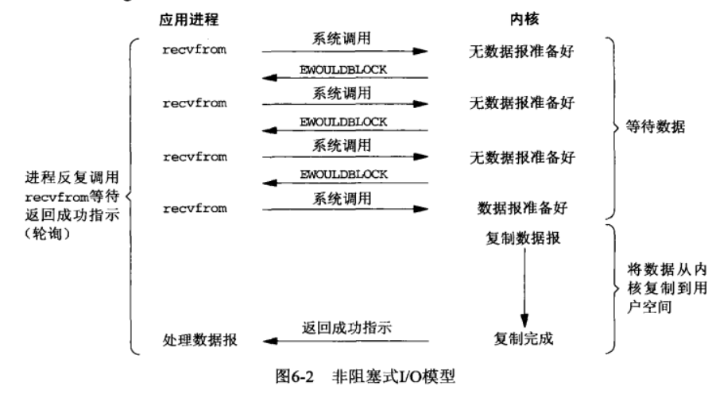
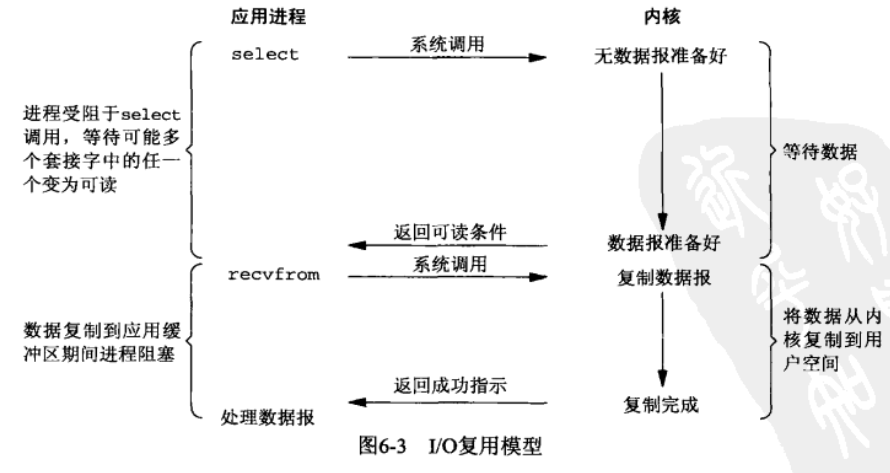
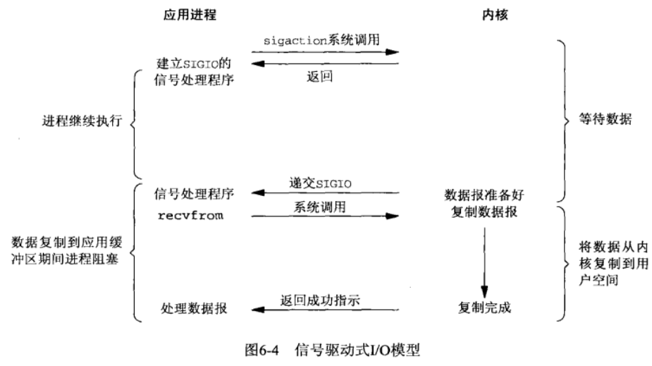
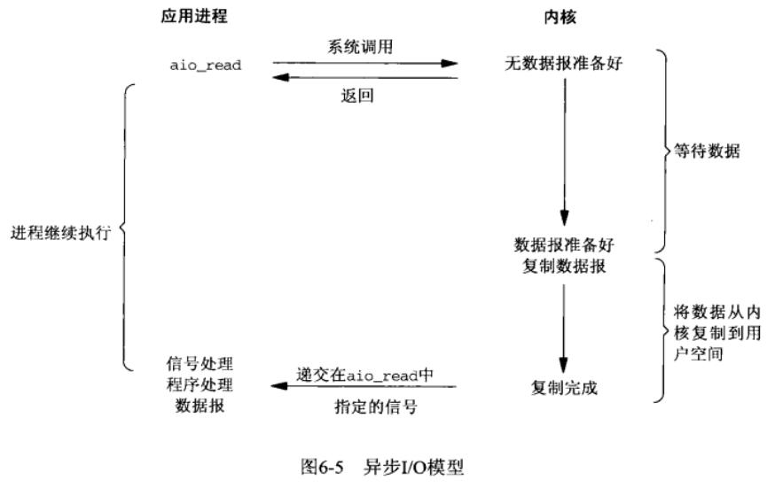
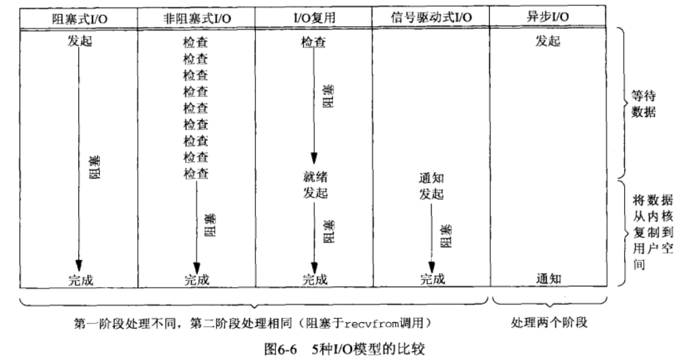

# Unix的I/O模型
{docsify-updated}

# 几种I/O模型

Unix下可用的5种I/O模型：
1. 阻塞式I/O
2. 非阻塞式I/O
3. I/O复用(select和poll)
4. 信号驱动式I/O(SIGIO)
5. 异步I/O(POSIX的aio_系列函数)

## 阻塞式I/O模型
阻塞式I/O模型如图所示：

进程调用recvfrom，其通调用知道数据报到达且被复制到应用进程的缓冲区中或者发生错误才返回。从调用recvfrom开始到它返回的这段时间内，进程是被阻塞的。recvfrom成功返回后，进程被唤醒，开始处理数据报。

## 非阻塞式I/O模型
进程把一个套接字设置成非阻塞是在通知内核：当所请求的I/O操作非得把进程投入睡眠才能完成时，不要把本进程设置为阻塞，而是返回一个错误。

如图所示，前三次调用recvfrom时没有数据可返回，内核立即返回一个EWOULDBLOCK错误，这三次重复调用时进程主动发起的，进程不能处于阻塞状态。第四次调用revfrom时已经有一个数据准备好了，它被复制到进程缓冲区，在复制过程中，进程处阻塞状态，复制完成后，进程被唤醒，开始处理数据。

当一个进程像这样对一个非阻塞描述符循环调用recvfrom时，我们称之为轮询（polling）。应用进程持续轮询内核，以查看某个操作是否完成。

## I/O复用模型
有了I/O复用，我们就可以调用select或poll，阻塞在这两个系统调用中的某一个上，而不是阻塞在真正的I/O系统调用之上。

我们阻塞于select调用，等待数据报套接字变为可读。当select返回套接字可读时，我们调用recvfrom把所读数据复制到应用程序缓冲区中。所以这里其实有两次系统调用，并且每次都是阻塞的。

与阻塞式I/O模型比较，I/O复用并不显得有什么优势，事实上，I/O复用的select需要两个而不是单个系统调用该，还稍有劣势。不过，I/O复用与阻塞式调用最大的区别在于，I/O复用的优势在于可以等待多个描述符，这也是I/O复用名字的来源，多个I/O套接字复用一个进程。

与I/O复用密切相关的是另一种I/O模型是在多线程中使用阻塞式I/O。这种模型与I/O复用的区别在于：它没有使用select或poll阻塞在多个描述符上，而是使用多线程（每个描述符一个线程），每个线程可以自由的调用阻塞式recvfrom之类的系统调用。线程与描述符是一一对应的，而I/O是一对多的。

## 信号驱动式I/O模型
使用信号，让内核在描述符就绪时发送SIGIO信号通知我们。

首先开启套接字的信号驱动式I/O功能，并通过sigaction系统调用安装一个信号处理函数。sigaction系统调用会立即返回，不会阻塞线程。当数据报准备就绪时，内核就为该进程产生一个SIGIO信号。我们随后可以在信号处理函数中调用recvfrom读取数据，并通知主循环数据已经准备好，也可以通知主循环，让他读取数据报。

无论如何处理SIGIO信号，这种模型的优势在于等待数据报到达期间进程不被阻塞。主循环继续执行，只要等待来自信号处理函数的通知：既可以是数据已准备好，也可以是数据准备好被读取了。

## 异步I/O模型(POSIX的aio_系列函数)
异步I/O的工作机制是：告知系统内核启动一个操作，并让内核在整个操作（包括数据从内核复制到进程缓冲区）完成后通知进程。与信号驱动的I/O模型的主要区别在于：

信号驱动式I/O是由内核通知我们可以启动一个I/O操作，而异步I/O模型是由内核告知我们I/O操作何时完成。

调用aio_read(或者其他异步IO函数)时，系统调用会立即返回，而且在进程完成期间，我们的进程不会被阻塞。上图中假设要求内核在操作完成时发送某个信号。该信号直到数据已复制到应用进程缓存区中时才会产生信号，这一点不同于信号驱动式I/O模型。

# 各种I/O模型的比较
前四种模型的主要区别在于第一阶段，因为他们的第二阶段是一样的：在数据从内核拷贝到进程缓冲区期间，进程阻塞于recvfrom调用。相反，异步I/O模型在这两个阶段都要处理。

## 同步I/O与异步I/O的对比
维基上的定义：
异步IO是计算机操作系统对输入输出的一种处理方式：发起IO请求的线程不等IO操作完成，就继续执行随后的代码，IO结果用其他方式通知发起IO请求的程序。与异步IO相对的是更为常见的“同步（阻塞）IO”：发起IO请求的线程不从正在调用的IO操作函数返回（即被阻塞），直至IO操作完成。

POSIX把这两个术语定义如下：
+ 同步I/O操作：导致请求进程阻塞，知道I/O操作何时完成。
+ 异步I/O操作：不导致请求进程阻塞。

根据上述定义：前4种都是同步I/O，只有异步I/O模型与POSIX的异步I/O相匹配。

