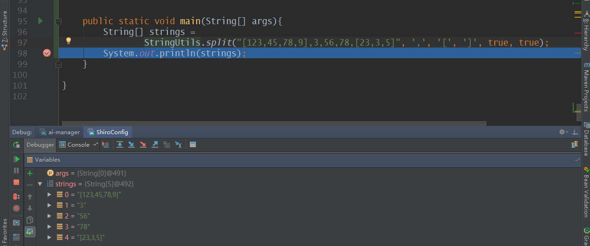

# shiro中的FilterChainManager分析
{docsify-updated}

# shiro中的`FilterChainManager`分析

## `FilterChainManager`接口
`FilterChainManager`主要提供了管理`FilterChain`的功能。定义如下：

    public interface FilterChainManager {
        Map<String, Filter> getFilters();
        NamedFilterList getChain(String var1);
        boolean hasChains();
        Set<String> getChainNames();
        FilterChain proxy(FilterChain var1, String var2);
        void addFilter(String var1, Filter var2);
        void addFilter(String var1, Filter var2, boolean var3);
        void createChain(String var1, String var2);
        void addToChain(String var1, String var2);
        void addToChain(String var1, String var2, String var3) throws ConfigurationException;
    }
`FilterChain`是 `javax.servlet`包下的标准对象类。

## `DefaultFilterChainManager`

### `DefaultFilterChainManager`的域
shiro中只有一个默认的`FilterChainManager`的实现，即`DefaultFilterChainManager`：

    public class DefaultFilterChainManager implements FilterChainManager {
        private FilterConfig filterConfig;
        private Map<String, Filter> filters = new LinkedHashMap();
        private Map<String, NamedFilterList> filterChains = new LinkedHashMap();
        .....
    }
其中，`NamedFilterList`类定义如下：

    public interface NamedFilterList extends List<Filter> {
        String getName();
        FilterChain proxy(FilterChain var1);
    }
可以看出，该类对标准的`FilterChain`进行了封装，将一个`FilterChain`对象和一个名字关联起来，名字通过`getName()`方法获取。

### `DefaultFilterChainManager`的两个构造方法：

    public DefaultFilterChainManager() {
        this.addDefaultFilters(false);
    }

    public DefaultFilterChainManager(FilterConfig filterConfig) {
        this.setFilterConfig(filterConfig);
        this.addDefaultFilters(true);
    }

`addDefaultFilters`方法：

    protected void addDefaultFilters(boolean init) {
        DefaultFilter[] var2 = DefaultFilter.values();
        int var3 = var2.length;
        for(int var4 = 0; var4 < var3; ++var4) {
            DefaultFilter defaultFilter = var2[var4];
            this.addFilter(defaultFilter.name(), defaultFilter.newInstance(), init, false);
        }

    }
`addDefaultFilters`方法主要是遍历`DefaultFilter`枚举变量，获取每一个枚举值，实例化各个Filter对象，并调用`addFilter`方法。我们在配置url拦截时，使用的`anno`、`authc`等拦截器就是在此处生成的。

`DefaultFilter`是一个枚举类型，保存了shiro默认提供的一些Filter实现，并将其作为默认过滤器链使用：

    public enum DefaultFilter {
        anon(AnonymousFilter.class),
        authc(FormAuthenticationFilter.class),
        authcBasic(BasicHttpAuthenticationFilter.class),
        logout(LogoutFilter.class),
        noSessionCreation(NoSessionCreationFilter.class),
        perms(PermissionsAuthorizationFilter.class),
        port(PortFilter.class),
        rest(HttpMethodPermissionFilter.class),
        roles(RolesAuthorizationFilter.class),
        ssl(SslFilter.class),
        user(UserFilter.class);

        private final Class<? extends Filter> filterClass;
    }

### `addFilter`方法
我们接着看`addFilter`方法：

    protected void addFilter(String name, Filter filter, boolean init, boolean overwrite) {
        Filter existing = this.getFilter(name);
        if(existing == null || overwrite) {
            if(filter instanceof Nameable) {
                ((Nameable)filter).setName(name);
            }

            if(init) {
                this.initFilter(filter);
            }

            this.filters.put(name, filter);
        }

    }
此方法主要功能是将实例化的`Filter`对象保存到`filters`域，以其在`DefaultFilter`中的枚举名字为key，所以`filters`域主要是用来保存`Filter`对象的。

### 重要的`createChain`方法

    public void createChain(String chainName, String chainDefinition) {
        if(!StringUtils.hasText(chainName)) {
            throw new NullPointerException("chainName cannot be null or empty.");
        } else if(!StringUtils.hasText(chainDefinition)) {
            throw new NullPointerException("chainDefinition cannot be null or empty.");
        } else {
            if(log.isDebugEnabled()) {
                log.debug("Creating chain [" + chainName + "] from String definition [" + chainDefinition + "]");
            }

            String[] filterTokens = this.splitChainDefinition(chainDefinition);
            String[] var4 = filterTokens;
            int var5 = filterTokens.length;

            for(int var6 = 0; var6 < var5; ++var6) {
                String token = var4[var6];
                String[] nameConfigPair = this.toNameConfigPair(token);
                this.addToChain(chainName, nameConfigPair[0], nameConfigPair[1]);
            }

        }
    }
该方法首先调用了`splitChainDefinition`方法：

    protected String[] splitChainDefinition(String chainDefinition) {
        return StringUtils.split(chainDefinition, ',', '[', ']', true, true);
    }
`StringUtils.split()`方法比较复杂，为了了解其功能，对其进行调试，如下图：

可知，其功能主要是根据分隔符，对字符串进行分割，指定符号进行分组，比如上面用一对中括号"[]"，中括号括起来的部分作为一个整体，不对其内的部分进行切分。

获取到字符串数组后，调用了`toNameConfigPair`方法：

    protected String[] toNameConfigPair(String token) throws ConfigurationException {
        String msg;
        try {
            String[] e = token.split("\\[", 2);
            msg = StringUtils.clean(e[0]);
            if(msg == null) {
             ....
            } else {
                String config = null;
                if(e.length == 2) {
                    config = StringUtils.clean(e[1]);
                    config = config.substring(0, config.length() - 1);
                    config = StringUtils.clean(config);
                    if(config != null && config.startsWith("\"") && config.endsWith("\"")) {
                        String stripped = config.substring(1, config.length() - 1);
                        stripped = StringUtils.clean(stripped);
                        if(stripped != null && stripped.indexOf(34) == -1) {
                            config = stripped;
                        }
                    }
                }

                return new String[]{msg, config};
            }
        } catch (Exception var6) {
           ....
        }
    }
然后调用`addToChain`方法：

    public void addToChain(String chainName, String filterName, String chainSpecificFilterConfig) {
        if(!StringUtils.hasText(chainName)) {
            ....
        } else {
            Filter filter = this.getFilter(filterName);
            if(filter == null) {
                .....
            } else {
                this.applyChainConfig(chainName, filter, chainSpecificFilterConfig);
                NamedFilterList chain = this.ensureChain(chainName);
                chain.add(filter);
            }
        }
    }
该方法主要功能是，根据传来的`filterName`从`filters`域中获取一个拦截器对象，获取失败则报错，所以如果是自定义的filter，要记得添加进去，可以通过`ShiroFilterFactoryBean`添加，`ShiroFilterFactoryBean`会将添加的filter添加到`FilterChainManager`的`filters`域中，在分析`ShiroFilterFactoryBean`时会讲到。

然后，根据传来的`chainName`获取到`NamedFilterList`链，然后把获取到filter对象加入到该链中。

看一下`ensureChain`方法：

    protected NamedFilterList ensureChain(String chainName) {
        Object chain = this.getChain(chainName);
        if(chain == null) {
            chain = new SimpleNamedFilterList(chainName);
            this.filterChains.put(chainName, chain);
        }

        return (NamedFilterList)chain;
    }
该方法用来在`filterChains`获取拦截链，如果没有，则生成一个`SimpleNamedFilterList`类型的拦截器链，并将其保存到`filterChains`中。
`SimpleNamedFilterList`定义如下：

    public class SimpleNamedFilterList implements NamedFilterList {
        private String name;
        private List<Filter> backingList;
        .....
    }
可见其本质就是用一个`List`来保存`Filter`类型的对象，进行拦截的时候依次调用各个拦截器的方法。

