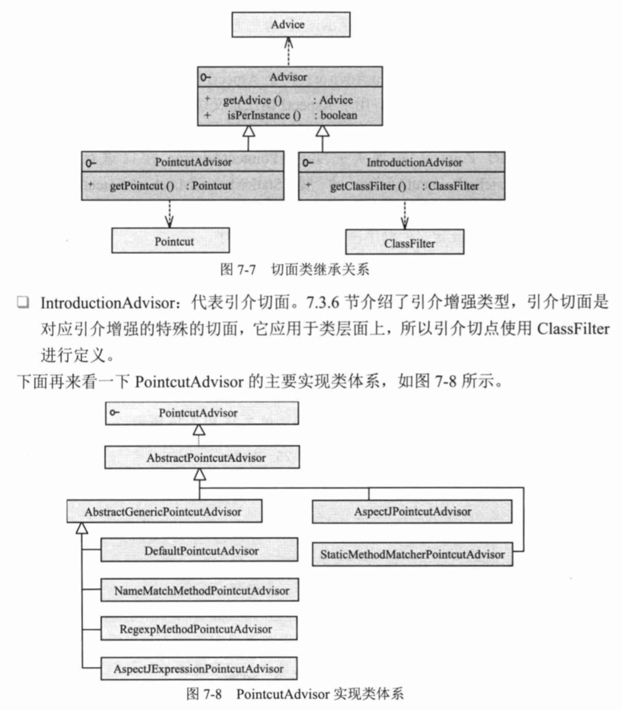
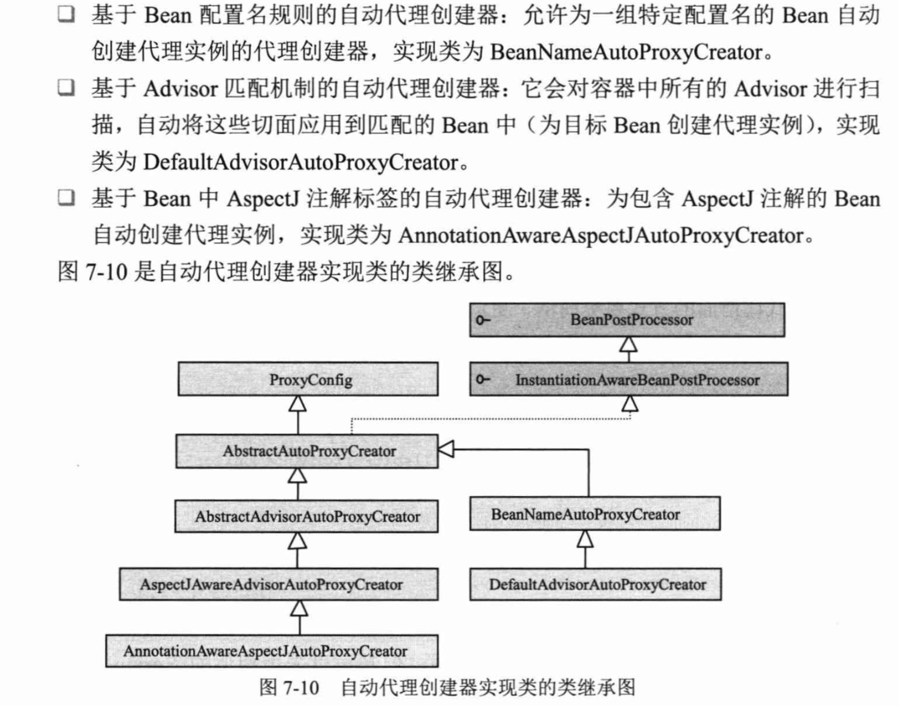

## spring AOP
{docsify-updated}

> https://docs.spring.io/spring-framework/reference/core/aop.html

- [spring AOP](#spring-aop)
- [实现机制](#实现机制)
- [概念术语](#概念术语)
	- [连接点(join point)](#连接点join-point)
	- [切点(point cut)](#切点point-cut)
	- [关于`join point` 和 `point cut` 的区别](#关于join-point-和-point-cut-的区别)
	- [增强（ Advice )](#增强-advice-)
	- [切面 (aspect)](#切面-aspect)
	- [织入(Weaving)](#织入weaving)
- [Spring AOP 的织入](#spring-aop-的织入)
	- [Spring AOP 的自动织入](#spring-aop-的自动织入)
- [@AspectJ 支持](#aspectj-支持)
	- [使能 @AspectJ 支持](#使能-aspectj-支持)
	- [定义aspect(切面)](#定义aspect切面)
	- [声明 pointcut](#声明-pointcut)
	- [切点标志符(designator)](#切点标志符designator)
	- [常见的切点表达式](#常见的切点表达式)
	- [声明 advice](#声明-advice)
		- [Before advice](#before-advice)
		- [around advice](#around-advice)


## 实现机制
1. 动态代理  
    引入动态代理后，我们可以将横切关注点逻辑（增强）封装到动态代理的 InvocationHandler 接口中，然后在运行期间，根据横切关注点的需要织入的模块位置，将横切逻辑织入到相应的代理类中。这种方式的缺点是所有要织入横切逻辑的模块类都要实现相应的接口，因为动态代理只对接口有效。
2. 动态字节码增强  
    使用ASM或者CGLIB等Java工具库，在程序运行期间，动态生成字节码文件，为需要织入横切逻辑的模块类动态生成相应的子类，将横切逻辑加到这些子类中。这样就可以克服动态代理需要实现接口的限制，不过字节码增强无法扩展final类和final方法。

## 概念术语
### 连接点(join point)
程序运行中的一些时间点, 例如一个方法的执行，构造方法的调用，属性设置及获取，或者是一个异常的处理等.但是在 Spring AOP 中, `join point` 总是方法的执行点, 即只支持方法连接点,不可以在类上增强。

### 切点(point cut)
匹配 `join point` 的谓词(a predicate that matches join points).
`Advice` 是和特定的 `point cut` 关联的, 并且在 `point cut` 相匹配的 `join point` 中执行. 
在 Spring 中, 所有的方法都可以认为是 `joinpoint`, 但是我们并不希望在所有的方法上都添加 `Advice`, 而 `pointcut` 的作用就是提供一组规则(使用 AspectJ pointcut expression language 来描述) 来匹配`joinpoint`, 给满足规则的 `joinpoint` 添加 `Advice`.

简而言之，切点就是用来筛选哪些连接点需要织入增强代码的。  
Pointcut接口的声明如下：
```java
public interface  {
    Pointcut TRUE = TruePointcut.INSTANCE;

    ClassFilter getClassFilter();

    MethodMatcher getMethodMatcher();
}
```
ClassFilter 和 MethodMatcher 分别用于匹配将被织入横切逻辑的对象和相应的方法，即类型匹配和方法匹配。
<center></center>

常见的 Pointcut:
1. `NameMatchMethodPointcut`
2. `JdkRegexpMethodPointcut`
3. `AnnotationMatchingPointcut`
4. `ComposablePointcut`

### 关于`join point` 和 `point cut` 的区别
在 Spring AOP 中, 所有的方法执行都是 `join point`. 而 `point cut` 是一个描述信息, 它修饰的是 `join point`, 通过 `point cut`, 我们就可以确定哪些 `join point` 可以被织入 Advice. 因此 `join point` 相当于数据库中的记录， 而 `point cut` 相当于带有查询条件查询出来的记录。
`advice` 是在 `join point `上执行的, 而 `point cut` 规定了哪些 `join point` 可以执行那些 `advice`.

### 增强（ Advice )
按照`Advice`实例能否在目标对象类的所有实例间共享这一标准，可以将`Advice`分为 `per-class` 和 `per-instance `类型：
+ per-class类型的 Advice，可以在所有目标类对象之间共享，不会保存任何目标对象的状态或者添加新特性。

  1. Before Advice: 在连接点指定位置之前执行的增强类型。

  2. After Advice: 在连接点指定位置之后执行的增强类型，该类型还有三种子类型：
     1. After returning advice: 只有切点处执行流程正常完成后，才会执行
     2. After throwing advice: 只有切点处执行流程抛出异常的情况下，才会执行
     3. After advice: 不管切点是正常执行还是异常了都会执行，相当于 finally 块一样。
     
  3. Around Advice（Interceptor）: 可以在切点之前和之后都指定相应的逻辑，甚至于中断或者忽略切点原来的程序流程的执行。Spring中没有直接定义对应的 Around Advice 的实现接口，而是直接采用 AOP Alliance的标准接口 `org.aopalliance.intercept.MethodInterceptor` , 这个接口只有一个 `invoke` 方法：

    ```java
    public interface MethodInterceptor extends Interceptor{
    	Object invoke(MethodInvocation invocation) throws Throwable;
    }
    ```
<center></center>

+ per-instance类型的 Advice，Advice对象不会在目标类对象的实例之间共享。不同的目标对象创建不同的`Advice`实例。在 Spring AOP 中， `Introduction` 是唯一一种per-instance类型的 Advice 。
  `Introduction`: 可以在不改动目标类定义的情况下，为原有的对象添加新的特性或者行为。在Spring中，为目标对象添加新的属性和行为必须声明相应的接口以及相应的实现。这样，再通过特定的拦截器将新的接口定义及实现类中的逻辑附加到目标对象上，目标对象就拥有了新的状态和行为。Spring中这个拦截器就是 ` IntroductionInterceptor` 接口来实现。
  <center></center>

### 切面 (aspect)
`aspect` 由 `pointcut` 和 `advice` 组成, 它既包含了横切逻辑(增强)的定义, 也包括了切点的定义. Spring AOP就是负责实施切面的框架, 它将切面所定义的横切逻辑织入到切面所指定的连接点中.
AOP的工作重心在于如何将增强织入目标对象的连接点上, 这里包含两个工作:

1. 如何通过 `pointcut` 和 `advice` 定位到特定的 joinpoint 上
2. 如何在 `advice` 中编写切面代码.

Spring 中使用 `org.springframework.aop.Advisor` 接口表示切面。可以划分为 `PointcutAdvisor `和 `IntroductionAdvisor` 两个分支。
1. PointcutAdvisor
    
2. IntroductionAdvisor
    IntroductionAdvisor 的类层次比较简单，只有一个 DefaultIntroductionAdvisor 的默认实现。

### 织入(Weaving)
将 aspect 和其他对象连接起来, 并创建 adviced object 的过程.

根据不同的实现技术, AOP织入有三种方式:

* 编译器织入, 这要求有特殊的Java编译器.AspectJ的 ajc 编译器
* 类装载期织入, 这需要有特殊的类装载器. Jboss AOP 自定义的 ClassLoader
* 动态代理织入, 在运行期为目标类添加增强(Advice)生成代理类的方式.

Spring 采用动态代理织入, 而AspectJ采用编译器织入和类装载期织入。
上述所有的概念可以由下面这张图大致概括：
<center></center>

## Spring AOP 的织入
AspectJ使用 ajc 编译器作为它的织入器，Jboss AOP 自定义的ClassLoader作为织入器， Spring AOP 中使用 ProxyFactory 作为织入器。使用 ProxyFactory 很简单，只需要以下3步：
1. 第一就是告诉它你要织入的目标对象：可以在构造函数中直接传入，也可以用setter方法设置
2. 第二就是告诉它要应用到目标对象的Aspect(Advisor)或者直接告诉它Advice：addAdvisor()/addAdvice()
3. 最后直接调用 ProxyFactory 的 getProxy() 方法就可以获得增强的代理对象
```
ProxyFactory proxyFactory = new ProxyFactory(targetObj);
//或者 proxyFactory.setTarget(targetObj);
proxyFactory.addAdvisor(advisor);
//或者 proxyFactory.addAdvice(advice);
Object proxy = proxyFactory.getProxy();
```
默认情况下，如果目标对象实现了接口， ProxyFactory 会使用 JDK 的动态代理生成代理对象，下述三种情况会使用基于类的代理：
1. 目标类没有实现任何接口，忽略 proxyTargetClass 的值
2. 如果 ProxyFactory 的 proxyTargetClass 属性为 true
3. 如果 ProxyFactory 的 optimize 属性为 true

上述方式主要是对于编程式AOP的支持。另外，为了支持容器，Spring提供了 ProxyFactoryBean 来支持配置式的AOP。

### Spring AOP 的自动织入
Spring 提供了自动代理机制，让容器自动生成代理，把开发人员从繁琐的配置工作中解放出来。在内部，Spring 使用 BeanPostProcessor 自动完成这项工作。只要提供一个 BeanPostProcessor，这个 BeanPostProcessor 在对象实例化时，为符合条件的 bean 生成代理对象并返回，而不是返回实例化的目标 bean 本身，可以用下述伪代码表示大致过程：
```
for(bean in beanfactory){
    if(如果要为该bean 生成代理对象){
        Object proxy = createProxy(bean);
        return proxy;
    }else{
        Object instance = createInstance(bean);
        return instance;
    }
}
```


## @AspectJ 支持
@AspectJ 是一种使用 Java 注解来实现 AOP 的编码风格.
@AspectJ 风格的 AOP 是 AspectJ Project 在 AspectJ 5 中引入的, 并且 Spring 也支持@AspectJ 的 AOP 风格.

### 使能 @AspectJ 支持
`@AspectJ` 可以以 XML 的方式或以注解的方式来使能, 并且不论以哪种方式使能@ASpectJ, 我们都必须保证 aspectjweaver.jar 在 classpath 中.

使用 Java Configuration 方式使能@AspectJ

    @Configuration
    @EnableAspectJAutoProxy
    public class AppConfig {
    }

使用 XML 方式使能@AspectJ

    <aop:aspectj-autoproxy/>

### 定义aspect(切面)
当使用注解 `@Aspect` 标注一个 Bean 后, 那么 Spring 框架会自动收集这些 Bean, 并添加到 Spring AOP 中, 例如:

    @Component
    @Aspect
    public class MyTest {
    }
注意, 仅仅使用@Aspect 注解, 并不能将一个 Java 对象转换为 Bean, 因此我们还需要使用类似 @Component 之类的注解.
注意, 如果一个类被@Aspect标注, 则这个类就不能是其他 aspect 的 **advised object** 了, 因为使用 @Aspect 后, 这个类就会被排除在 auto-proxying 机制之外.


### 声明 pointcut
一个 pointcut 的声明由两部分组成:

* 一个方法签名, 包括方法名和相关参数
* 一个 pointcut 表达式, 用来指定哪些方法执行是我们感兴趣的(即因此可以织入 advice).

在@AspectJ风格的AOP中, 我们使用一个方法来描述 pointcut, 即:

    @Pointcut("execution(* com.xys.service.UserService.*(..))") // 切点表达式
    private void dataAccessOperation() {} // 切点前面
这个方法必须无返回值.
这个方法本身就是 pointcut signature, pointcut 表达式使用@Pointcut 注解指定.
上面我们简单地定义了一个 pointcut, 这个 pointcut 所描述的是: 匹配所有在包 com.xys.service.UserService 下的所有方法的执行.

### 切点标志符(designator)
AspectJ5的切点表达式由标志符(designator)和操作参数组成. 如 "execution( greetTo(..))" 的切点表达式, execution 就是标志符, 而圆括号里的 greetTo(..) 就是操作参数.

1. execution
   
    匹配 join point 的执行, 例如 "execution(* hello(..))" 表示匹配所有目标类中的 hello() 方法. 这个是最基本的 pointcut 标志符.

2. within
   
    匹配特定包下的所有 join point, 例如 within(com.xys.\*) 表示 com.xys 包中的所有连接点, 即包中的所有类的所有方法. 而 within(com.xys.service.*Service) 表示在 com.xys.service 包中所有以 Service 结尾的类的所有的连接点.

3. this 与 target
   
    this 的作用是匹配一个 bean, 这个 bean(Spring AOP proxy) 是一个给定类型的实例(instance of). 而 target 匹配的是一个目标对象(target object, 即需要织入 advice 的原始的类), 此对象是一个给定类型的实例(instance of).

4. bean

    匹配 bean 名字为指定值的 bean 下的所有方法, 例如:

    bean(*Service) // 匹配名字后缀为 Service 的 bean 下的所有方法
    bean(myService) // 匹配名字为 myService 的 bean 下的所有方法

5. args

    匹配参数满足要求的的方法.
    例如:

        @Pointcut("within(com.xys.demo2.*)")
        public void pointcut2() {
        }
    
        @Before(value = "pointcut2()  &&  args(name)")
        public void doSomething(String name) {
            logger.info("---page: {}---", name);
        }
    
        @Service
        public class NormalService {
            private Logger logger = LoggerFactory.getLogger(getClass());
    
            public void someMethod() {
                logger.info("---NormalService: someMethod invoked---");
            }


            public String test(String name) {
                logger.info("---NormalService: test invoked---");
                return "服务一切正常";
            }
        }
    当 NormalService.test 执行时, 则 advice doSomething 就会执行, test 方法的参数 name 就会传递到 doSomething 中.

常用例子:

     // 匹配只有一个参数 name 的方法
    @Before(value = "aspectMethod()  &&  args(name)")
    public void doSomething(String name) {
    }
    // 匹配第一个参数为 name 的方法
    @Before(value = "aspectMethod()  &&  args(name, ..)")
    public void doSomething(String name) {
    }
    
    // 匹配第二个参数为 name 的方法
    Before(value = "aspectMethod()  &&  args(*, name, ..)")
    public void doSomething(String name) {
    }

 6. @annotation

    匹配由指定注解所标注的方法, 例如:

        @Pointcut("@annotation(com.xys.demo1.AuthChecker)")
        public void pointcut() {
        }
    则匹配由注解 AuthChecker 所标注的方法.

### 常见的切点表达式

* 匹配方法签名

        // 匹配指定包中的所有的方法
        execution(* com.xys.service.*(..))
    
        // 匹配当前包中的指定类的所有方法
        execution(* UserService.*(..))
    
        // 匹配指定包中的所有 public 方法
        execution(public * com.xys.service.*(..))
    
        // 匹配指定包中的所有 public 方法, 并且返回值是 int 类型的方法
        execution(public int com.xys.service.*(..))
    
        // 匹配指定包中的所有 public 方法, 并且第一个参数是 String, 返回值是 int 类型的方法
        execution(public int com.xys.service.*(String name, ..))

* 匹配类型签名

        // 匹配指定包中的所有的方法, 但不包括子包
        within(com.xys.service.*)
    
        // 匹配指定包中的所有的方法, 包括子包
        within(com.xys.service..*)
    
        // 匹配当前包中的指定类中的方法
        within(UserService)


        // 匹配一个接口的所有实现类中的实现的方法
        within(UserDao+)

* 匹配 Bean 名字
* 
        // 匹配以指定名字结尾的 Bean 中的所有方法
        bean(*Service)

* 切点表达式组合

        // 匹配以 Service 或 ServiceImpl 结尾的 bean
        bean(*Service || *ServiceImpl)
    
        // 匹配名字以 Service 结尾, 并且在包 com.xys.service 中的 bean
        bean(*Service) && within(com.xys.service.*)


### 声明 advice
advice 是和一个 pointcut 表达式关联在一起的, 并且会在匹配的 join point 的方法执行的前/后/周围 运行. pointcut 表达式可以是简单的一个 pointcut 名字的引用, 或者是完整的 pointcut 表达式.
下面我们以几个简单的 advice 为例子, 来看一下一个 advice 是如何声明的.

#### Before advice
    /**
     * @author xiongyongshun
     * @version 1.0
     * @created 16/9/9 13:13
     */
    @Component
    @Aspect
    public class BeforeAspectTest {
        // 定义一个 Pointcut, 使用 切点表达式函数 来描述对哪些 Join point 使用 advise.
        @Pointcut("execution(* com.xys.service.UserService.*(..))")
        public void dataAccessOperation() {
        }
    }
    
    @Component
    @Aspect
    public class AdviseDefine {
        // 定义 advise
        @Before("com.xys.aspect.PointcutDefine.dataAccessOperation()")
        public void doBeforeAccessCheck(JoinPoint joinPoint) {
            System.out.println("*****Before advise, method: " + joinPoint.getSignature().toShortString() + " *****");
        }
    }
这里, @Before 引用了一个 pointcut, 即 "com.xys.aspect.PointcutDefine.dataAccessOperation()" 是一个 pointcut 的名字.
如果我们在 advice 在内置 pointcut, 则可以:

    @Component
    @Aspect
    public class AdviseDefine {
        // 将 pointcut 和 advice 同时定义
        @Before("within(com.xys.service..*)")
        public void doAccessCheck(JoinPoint joinPoint) {
            System.out.println("*****doAccessCheck, Before advise, method: " + joinPoint.getSignature().toShortString() + " *****");
        }
    }

#### around advice

around advice 比较特别, 它可以在一个方法的之前之前和之后添加不同的操作, 并且甚至可以决定何时, 如何, 是否调用匹配到的方法.

    @Component
    @Aspect
    public class AdviseDefine {
        // 定义 advise
        @Around("com.xys.aspect.PointcutDefine.dataAccessOperation()")
        public Object doAroundAccessCheck(ProceedingJoinPoint pjp) throws Throwable {
            StopWatch stopWatch = new StopWatch();
            stopWatch.start();
            // 开始
            Object retVal = pjp.proceed(); 
            stopWatch.stop();
            // 结束
            System.out.println("invoke method: " + pjp.getSignature().getName() + ", elapsed time: " + stopWatch.getTotalTimeMillis());
            return retVal;
        }
    }
around advice 和前面的 before advice 差不多, 只是我们把注解 @Before 改为了 @Around 了.
