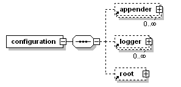

#  springboot 日志配置
 {docsify-updated}

添加依赖（如果项目引入了springboot-web，则默认已经导入）：
```
    <dependency>
      <groupId>org.springframework.boot</groupId>
      <artifactId>spring-boot-starter-logging</artifactId>
      <version>2.7.3</version>
      <scope>compile</scope>
    </dependency>
```

## logger
一个 Logger 被当作为一个实体，它们的命名是**大小写敏感的**，并且遵循以下规则：
> 命名层次结构
>
> 如果一个 logger 的名字加上一个 `.` 可以作为另一个 logger 名字的前缀，那么该 logger 就是另一个 logger 的祖先。如果一个 logger 与另一个 logger 之间没有其它的 logger ，则该 logger 就是另一个 logger 的父级。

Logger 能够被分成不同的等级。不同的等级（TRACE, DEBUG, INFO, WARN, ERROR）定义在 `ch.qos.logback.classic.Level` 类中。  

如果一个给定的 logger 没有指定一个等级，那么它就会继承离它最近的一个祖先的等级。更正式的说法是：
> 对于一个给定的名为 *L* 的 logger，它的有效等级为从自身一直回溯到 root logger，直到找到第一个祖先不为空的等级作为自己的等级。

为了确保所有的 logger 都有一个等级，root logger 会有一个默认等级 --- **DEBUG**

> **基本选择规则**
> 
> 日志的打印级别为 *p*，Logger 实例的级别为 *q*，如果 *p* >= *q*，则该条日志可以打印出来。

这条规则是 logbakc 的核心。各级别的排序为：**TRACE** < **DEBUG** < **INFO** < **WARN** < **ERROR**。

## Appender
对于给定的 logger，每一个允许输出的日志都会被转发到该 logger 的所有 appender 中去。换句话说，appender 从 logger 的等级结构中去继承叠加性。例如：如果 root logger 添加了一个 console appender，所有允许输出的日志至少会在控制台打印出来。如果再给一个叫做 ***L*** 的 logger 添加了一个 file appender，那么 ***L*** 以及 ***L*** 的子级 logger 都可以在文件和控制台打印日志。可以通过设置 additivity = false 来改写默认的设置，这样 appender 将不再具有叠加性。

appender 的叠加性规则如下：

> appender 的叠加性
>
> logger *L* 的日志输出语句会遍历 *L* 和它的父级中所有的 appender。这就是所谓的 appender 叠加性（appender additivity）
>
> 如果 *L* 的某个上级 logger 为 *P*，且 *P* 设置了 additivity = false，那么 *L* 的日志会在等级在 *L* 到 *P* 之间的所有 logger 的 appender，包括 *P* 本身的 appender 中输出，但是不会在 *P* 的上级 appender 中输出。
>
> logger 默认设置 additivity = true。

## Layout

通常，用户既想自定义日志的输出地，也想自定义日志的输出格式。通过给 appender 添加一个 *layout* 可以做到。layout 的作用是将日志格式化，而 appender 的作用是将格式化后的日志输出到指定的目的地。**PatternLayout** 能够根据用户指定的格式来格式化日志，类似于 C 语言的 printf 函数。

## Logback 配置
以下是 logback 的初始化步骤：

1. logback 会在类路径下寻找名为 logback-test.xml 的文件。
2. 如果没有找到，logback 会继续寻找名为 logback.groovy 的文件。
3. 如果没有找到，logback 会继续寻找名为 logback.xml 的文件。
4. 如果没有找到，将会通过 JDK 提供的 [ServiceLoader](https://docs.oracle.com/javase/6/docs/api/java/util/ServiceLoader.html) 工具在类路径下寻找文件 *META-INFO/services/ch.qos.logback.classic.spi.Configurator*，该文件的内容为实现了 [`Configurator`](https://logback.qos.ch/xref/ch/qos/logback/classic/spi/Configurator.html) 接口的实现类的全限定类名。
5. 如果以上都没有成功，logback 会通过 [BasicConfigurator](https://logback.qos.ch/xref/ch/qos/logback/classic/BasicConfigurator.html) 为自己进行配置，并且日志将会全部在控制台打印出

通过系统属性 `logback.configurationFile` 可以指定默认的配置文件的路径。它的值可以是 URL，类路径下的文件或者是应用外部的文件。

```
java -Dlogback.configurationFile=/path/to/config.xml chapters.configuration.MyApp1
```

> 注意：文件类型只能是 ".xml" 或者 ".groovy"，其它的拓展文件将会被忽略。

因为 `logback.configureFile` 是一个系统属性，所以也可以在应用内进行设置。但是必须在 logger 实例创建前进行设置。

为了让 logback 能够在配置文件改变的时候自动去扫描，需要在 `<configuration>` 标签上添加 `scan=true` 属性。默认情况下，一分钟扫描一次配置文件，看是否有更改。通过 `<configuration>` 标签上的 `scanPeriod` 属性可以指定扫描周期。扫描周期的时间单位可以是毫秒、秒、分钟或者小时。

logback 的配置文件非常的灵活，不需要指定 DTD 或者 xml 文件需要的语法。但是，最基本的结构为 `<configuration>` 元素，包含 0 或多个 `<appender>` 元素，其后跟 0 或多个 `<logger>` 元素，其后再跟最多只能存在一个的 `<root>` 元素。基本结构图如下：



```
<configuration debug="true">
    <appender name="STDOUT" class="ch.qos.logback.core.ConsoleAppender">
        <encoder>
            <pattern>%d{HH:mm:ss.SSS} [%thread] %-5level %logger{36} - %msg%n</pattern>
        </encoder>
    </appender>
    
    <logger name="org.example" level="INFO" >
        <appender-ref ref="STDOUT"/>
    </logger>

    <root level="all">
        <appender-ref ref="STDOUT" />
    </root>
</configuration>
```

1. 配置 logger  
	通过 `<logger>` 标签来过 logger 进行配置，一个 `<logger>` 标签必须包含一个 *name* 属性，一个可选的 *level* 属性，一个可选 *additivity* 属性。`additivity` 的值为 *true* 或 *false*。`level` 的值为 TRACE，DEBUG，INFO，WARN，ERROR，ALL，OFF，INHERITED，NULL。当 `level` 的值为 INHERITED 或 NULL 时，将会强制 logger 继承上一层的级别。

	`<logger>` 元素至少包含 0 或多个 `<appender-ref>` 元素。每一个 appender 通过这种方式被添加到 logger 上。

	root logger 通过 `<root>` 元素来进行配置。它只支持一个属性——`level`。它不允许设置其它任何的属性，因为 additivity 并不适用 root logger。而且，root logger 的名字已经被命名为 "ROOT"，也就是说也不支持 name 属性。level 属性的值可以为：TRACE、DEBUG、INFO、WARN、ERROR、ALL、OFF，但是不能设置为 INHERITED 或 NULL。

2. 配置 appender  
	appender 通过 `<appender>` 元素进行配置，需要两个强制的属性 *name* 与 *class*。*name* 属性用来指定 appender 的名字，*class* 属性需要指定类的全限定名用于实例化。`<appender>` 元素可以包含 0 或一个 `<layout>` 元素，0 或多个 `<encoder>` 元素，0 或多个 `<filter>` 元素。除了这些公共的元素之外，`<appender>` 元素可以包含任意与 appender 类的 JavaBean 属性相一致的元素，下图展示了一些常见的结构：

	

3. 配置 layout  
	`<layout>` 元素强制一个 class 属性去指定一个类的全限定名，用于实例化。与 `<appender>` 元素一样，`<layout>` 元素也可以包含与 layout 实例相关的属性。如果 layout 的 class 是 `PatternLayout`，那么 class 属性可以被隐藏掉，因为这个很常见。.

	`<encoder` 元素强制一个 class 属性去指定一个类的全限定名，用于实例化。如果 encoder 的 class 是 `PatternLayoutEncoder`，那么基于[默认类映射]()，class 属性可以被隐藏。

	ch.qos.logback.core.ConsoleAppender: 就跟名字显示的一样，是将日志事件附加到控制台，跟进一步说就是通过 `System.out` 或者 `System.err` 来进行输出。默认通过前者

## 多环境日志配置
在不同的profile 或者配置文件中配置不同的日志配置文件：
```
logging.config=src/main/resources/logback-prod.xml
logging.config=src/main/resources/logback-dev.xml
logging.config=src/main/resources/logback-test.xml
```

## MDC(Mapped Diagnostic Context) 及 @Async 的跨线程配置
MDC用于标记每个请求。它是通过将关于请求的上下文信息放入MDC来完成的，MDC数据结构上类似与Map 数据结构，可以put/get 存取数据。Logback 的 MDC 是与线程绑定的，本质上是 ThreadLocal 的对象。所以跨线程时MDC的数据无法同步。需要手动同步，在 @Async 的配置方案如下：
```
@Configuration
@PropertySource(value = "classpath:/configuration/${env}/pool.yml", factory = YamlPropertySourceFactory.class)
@ConfigurationProperties(prefix = "task.pool")
@Data
@EnableAsync
public class AsyncThreadPoolConfig implements AsyncConfigurer {
    private Integer coreSize;
    private Integer maxSize;
    private Integer queueSize;
    private Integer keepAlive;

    @Override
    public Executor getAsyncExecutor() {
        ThreadPoolTaskExecutor executor = new ThreadPoolTaskExecutor();
        executor.setThreadNamePrefix("user-service-pool");
        executor.setTaskDecorator(new MdcTaskDecorator());
        executor.setCorePoolSize(coreSize);
        executor.setMaxPoolSize(maxSize);
        executor.setQueueCapacity(queueSize);
        executor.setKeepAliveSeconds(keepAlive);
        executor.initialize();
        return executor;
    }

}

public class MdcTaskDecorator implements TaskDecorator {
    @Override
    public Runnable decorate(Runnable runnable) {
        // Right now: Web thread context !
        // (Grab the current thread MDC data)
        Map<String, String> contextMap = MDC.getCopyOfContextMap();
        return () -> {
            try {
                // Right now: @Async thread context !
                // (Restore the Web thread context's MDC data)
                MDC.setContextMap(contextMap);
                runnable.run();
            } finally {
                MDC.clear();
            }
        };
    }
}
```

如果是自己维护的线程池，可以再创建线程池时传入自定义的 ThreadFactory threadFactory 参数，在自定义 ThreadFactory 中创建线程时，传递 MDC 对象。

## 命令行启用debug 级别
```
java -jar myproject-0.0.1-SNAPSHOT.jar --debug
```
