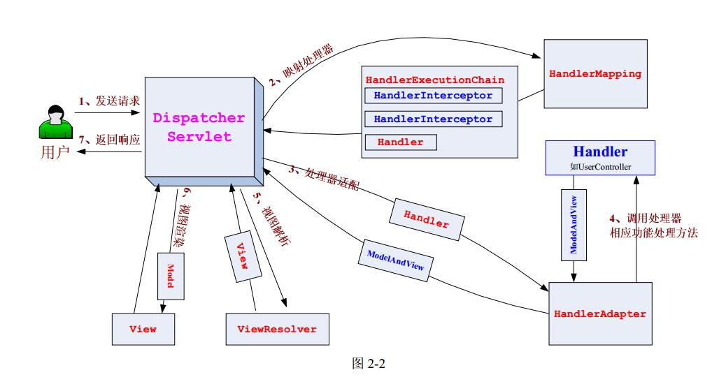

# Spring MVC 整体运行流程和架构
{docsify-updated}

# 整体运行流程

看 `DispatcherServlet` 的 `doDispatch` 方法：

    protected void doDispatch(HttpServletRequest request, HttpServletResponse response) throws Exception {
		HandlerExecutionChain mappedHandler = null;
		ModelAndView mv = null;
		Exception dispatchException = null;

        // 调用HandlerMapping获取HandlerExecutionChain
        HandlerExecutionChain mappedHandler = getHandler(processedRequest);
        
        // 为Handler找到合适的HandlerAdapter
        HandlerAdapter ha = getHandlerAdapter(mappedHandler.getHandler());

        //调用HandlerExecutionChain中所有HandlerInterceptor的preHandle方法
        if (!mappedHandler.applyPreHandle(processedRequest, response)) {
            return;
        }

        // Actually invoke the handler.
        mv = ha.handle(processedRequest, response, mappedHandler.getHandler());

        if (asyncManager.isConcurrentHandlingStarted()) {
            return;
        }
        applyDefaultViewName(processedRequest, mv);

        //调用HandlerExecutionChain中所有HandlerInterceptor的postHandle方法
        mappedHandler.applyPostHandle(processedRequest, response, mv);		
        processDispatchResult(processedRequest, response, mappedHandler, mv, dispatchException);
	}

# 组件分析
上图中可以看出，Spring MVC主要包括： `HandlerMapping` 、 `HandlerExecutionChain` 、 `HandlerAdapter` 、 `ModelAndView` 、 `ViewResolver` 、 `HandlerExceptionResolver。` 

## HandlerMapping
`HandlerMapping` 接口只有一个方法：

    @Nullable
	HandlerExecutionChain getHandler(HttpServletRequest request) throws Exception;
返回一个 `HandlerExecutionChain` 对象，所以 `HandlerMapping` 主要作用就是找到一个合适的 `HandlerExecutionChain`.

## HandlerExecutionChain
`HandlerExecutionChain` 主要包含以下几个成员：
    
    private final Object handler;
	private HandlerInterceptor[] interceptors;
	private List<HandlerInterceptor> interceptorList;
一个处理请求的 `handler` 以及一些用来拦截请求的 `HandlerInterceptor` 对象。当 `DispatcherServlet` 对象处理请求时，首先会调用  `HandlerExecutionChain`的 `applyPreHandle` 方法，该方法会调用 `interceptors` 数组中的所有 `HandlerInterceptor` 的 `preHandle` 方法。
`HandlerExecutionChain`的 `applyPostHandle` 方法，该方法会调用 `interceptors` 数组中的所有 `HandlerInterceptor` 的 `postHandle` 方法。

## HandlerAdapter
`HandlerAdapter` 是为了适配所有不同种类的 `handler` ， `HandlerExecutionChain` 中的 `handler` 是 `Object` 类型的，处理请求的对象有很多种，比如有 `Controller` 、 `Servlet` 、 `POJO Bean` 等，处理方法是不同的，不可能再 `DispatcherServlet` 为所有类型做判断，调用相应的处理方法。因此使用一个适配器，将所有的方法都统一成一个方法：

    ModelAndView handle(HttpServletRequest request, HttpServletResponse response, Object handler) throws Exception;
因此，在 `DispatcherServlet` 种就可以用一行代码：

    mv = ha.handle(processedRequest, response, mappedHandler.getHandler());
应对所有处理器。

`HandlerAdapter` 还有一个方法：
    
    boolean supports(Object handler);
这个方法用来判断这个适配器是否支持某个处理器对象。

## ModelAndView
`ModelAndView` 有两个主要成员：

	private Object view; //view对象或者字符串
	private ModelMap model;  //view渲染要用的数据

## ViewResolver
`ViewResolver` 用来解析 `View` 对象，当 `ModelAndView` 中的 `view` 成员不是直接的 `View` 对象，而是字符串时，需要根据这个字符串去解析出真正的 `View` 对象。

## HandlerExceptionResolver

当 handler 处理抛出异常时， `DispatcherServlet` 在下面函数中使用 `HandlerExceptionResolver` 来处理异常：

    protected ModelAndView processHandlerException(HttpServletRequest request, HttpServletResponse response,
			@Nullable Object handler, Exception ex) throws Exception {
		// Check registered HandlerExceptionResolvers...
		ModelAndView exMv = null;
		if (this.handlerExceptionResolvers != null) {
			for (HandlerExceptionResolver handlerExceptionResolver : this.handlerExceptionResolvers) {
				exMv = handlerExceptionResolver.resolveException(request, response, handler, ex);
				if (exMv != null) {
					break;
				}
			}
		}
			return exMv;
	}
因此，我们可以实现 `HandlerExceptionResolver` 接口来统一处理业务代码抛出的异常。