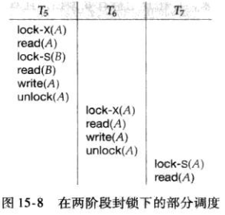

# 基于锁的协议
{docsify-updated}

## 锁的种类
给数据项加锁的方式有多种，我们只考虑两种：

1. 共享的(shared)：如果事务$T_i$获得了数据项Q上的共享型锁(shared-mode-lock)(记为S),则$T_i$可读但不能写Q
2. 排它的(exclusive)：如果事务$T_i$获得了数据项Q上的排它型锁(exclusive-mode-lock)(记为X),则$T_i$可读也可写Q。

这两种类型的锁可以让并发的多个事务读取同一个数据项Q，但是同时只能有一个事务进行写操作。

我们要求每个事务都要根据自己将对数据项Q执行的操作申请适当的锁。这个申请发送给并发控制管理器，事务只有在并发控制管理器授予所需锁后才能继续其操作。

## 锁的相容性
对于给定的一个锁类型集合，我们可以在此集合之上定义一个**相容函数**：令A与B是集合中任意的两个锁类型，假设事务$T_i$请求对数据项Q加A类锁，而事务$T_j$($T_i$ &ne;$T_j$)当前在数据项Q上拥有B类型的锁。如果此时$T_i$可以立即获得数据项Q上的A类锁，我们说A类型锁与B类型锁是**相容的**。

根据上述定义，共享锁和排它锁的相容性关系如下：

|   | S | X | 
| - | :-: | -: | 
| S | true| false | 
| X | false | false | 

要访问一个数据项，事务$T_i$必须先给该数据项加锁。如果该数据项已经被另一个事务加上了一个**不相容**的锁，则在所有其它事务持有的不相容锁释放之前，并发管理器不会授予该事物锁。因此$T_i$必须等待所有其它事务持有的不相容类型锁被释放。

## 锁释放的时机
下边是一个从账户B转账50\$到账户A的事务：
<center></center>

下边是一个调度：
<center></center>

因为$T_1$过早的释放了锁，从而导致$T_2$看到了不一致的转态。所以锁释放的时机是一个需要考虑的问题。

## 死锁
假定事务结束后才释放锁。
<center></center>
<center></center>

下边这个调度：
<center></center>

上边这个调度会导致死锁。

## 封锁协议
一方面，如果我们不使用锁，或者使用锁时，在不恰当的时间释放锁，可能会进入数据**不一致**的状态。另一方面，如果在持有某数据项的锁时申请另一个数据项的锁，则可能会发生**死锁**。一般来说，产生死锁比进入不一致状态要好，因为可以通过回滚事务解决死锁，而不一致状态可能会引起现实应用中的问题，不一致状态是与业务相关的，是程序员负责的，是数据库不能处理的。

因此，我们必须要求系统中的每一个事务遵循称为**封锁协议**的一组规则，这些规则规定事务何时对数据项进行加锁、解锁。封锁协议限制了可能的调度数目。意思是说这组规则过滤了一些可能会产生死锁或不一致状态的调度，比如一个好的调度会杜绝上述产生死锁的调度。

我们给出下面几个定义：

1. 令${T_0,T_1,.....T_n}$是参与调度S的一个事务集合，如果存在数据项Q，使得$T_i$在Q上持有A类锁，后来，$T_j$在Q上持有B类锁，且A、B不相容，则我们称为$T_i$**先于**$T_j$，记为$T_i$&rarr;$T_j$。
这一**居先**意味着，在任何等价的串行调度中，$T_i$一定先于$T_j$。
2. 如果调度S是这些遵从封锁协议规则的事务集合的可能调度之一，我们称S调度在给定的封锁协议下是合法的。
3. 当且仅当所有的合法调度都是冲突可串行化的时候，我们称这个封锁协议**保证**了冲突可串行化；换句话说，对于任何合法的调度，其关联的先于关系&rarr;是无环的。

定义了这么多的概念，无非是想找到一种**封锁协议**，使得在这种协议的规则之下，所有的合法事务调度都能成为冲突可串行化的，找到这种协议，我们就解决了死锁问题了。

## 锁的授予
可能会存在一个事务总是不能获取到某个数据项的锁，从而永远不可能取的进展，我们成为**饿死**。

我们可以通过如下方式授权加锁来避免事务饿死：当事务$T_i$申请对数据项Q加M型锁时，并发控制管理器授权加锁的条件是：

1. 不存在数据项Q上持有与M型锁不相容锁的其它事务；
2. 不存在等待数据项Q加锁且先于$T_i$申请加锁的事务。

## 两阶段封锁协议
保证可串行化的一个协议是**两阶段封锁协议**。该协议要求每个事务分两个阶段提出加锁和解锁申请：

1. **增长阶段**：事务可以获得锁，但不能释放锁。
2. **缩减阶段**：事务可以释放锁，但不能获得新锁。

对于任何事务，在调度中该事务获得其最后加锁位置(即增长阶段的结束点)称为事务的封锁点。这样多个事务可以根据其封锁点进行排序，实际上，这个顺序就是事务的一个可串行化顺序。

值得注意的是，两阶段封锁协议并不保证死锁不会发生。看上文中的图，T<sub>3</sub>与T<sub>4</sub>是两阶段的，但在调度2中确发生了死锁。

## 严格两阶段封锁协议
考虑下面的这个调度：

在事务T<sub>7</sub>的read(A)步骤之后事务T<sub>5</sub>发生故障，从而导致T<sub>6</sub>与T<sub>7</sub>发生级联回滚。

级联回滚可以通过将两阶段封锁修改为**严格两阶段封锁协议**加以避免。这个协议除了要求封锁是两阶段的之外，还要求事务持有的所有排它锁必须在事务提交之后方可释放。这个要求保证未提交事务缩写的任何数据在事务提交之前均以排它方式加锁，防止其它事务读这些数据。

## 强两阶段封锁协议

## Innodb 多版本并发控制（MVCC）
Mysql Innodb 引擎通过多版本并发控制（MVCC，multi version concurrency control)的方式来读取数据库行。假如有一个事务要读取某行数据，此时改行数据正好在执行 delete 或者 update 操作，这时事务不会等待行上的锁释放，而是去读取该行的一个快照数据。快照数据是指该行的之前版本的数据，是通过 undo 日志来实现的。

<center></center>

在 read committed 和 repeatable read 事务隔离级别下， Innodb 使用非锁定的一致性读。但是两者有所不同，在 read committed 级别下，总是读取最新版本的数据，就是说该事务执行过程中，如果锁定该行的事务（另一个并发事务）提交了，会读取新的版本，可能与事务开始时读的版本数据不同。但是在 repeatable read 级别下，总是读取事务开始时的版本数据，就是说即使锁定该行的事务提交了，该事务也不会读取最新版本而是依旧读取事务开始时读取的版本。

<center></center>

一致性锁定读：  
+ `select .... for update` 会对读取的数据加一个排他锁，其他事务不能对其加任何锁，若要加就会被阻塞。
+ `SELECT .... for share (8.0 之前版本用 select .... lock in share mode)`  会对读取的数据加一个共享锁，其他事务可以加共享锁。  
上述语句必须在一个事务中执行，事务结束时（提交或回滚）会释放锁。

## mysql 锁实战
`performance_schema.data_locks` 是 MySQL 8.0+ 中的一个非常有用的诊断系统表，用于查看当前数据库中哪些事务持有哪些锁、等待哪些锁，从而帮助你分析：
+ 死锁（deadlock）
+ 锁等待（lock wait）
+ 并发冲突（如阻塞、事务等待）
+ 行级锁状态（InnoDB）

通常与 `performance_schema.data_lock_waits` 和 `performance_schema.threads` 联用，用于分析阻塞链.


1. 查看	mysql 锁信息
```
select * from performance_schema.data_locks;
```