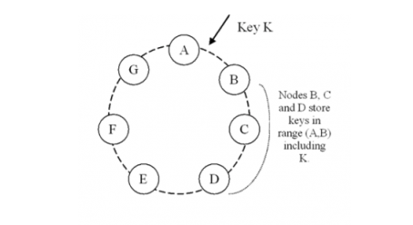

# 一致性哈希算法
{docsify-updated}

## 传统的 Hash 算法
假设有 N 台机器组成的缓存集群，关键字 K 缓存的目标机器编号由 hash(K)%N 计算出来。该方法存在以下问题：

1. 假设增加了一台机器，则新的计算方式为 hash(K)%(N+1),这样会导致所有的原有的缓存失效。如果不增加 N 的值，则新增的机器无法使用。
2. 假设有一台机器出现故障，则新的计算方式为 hash(K)%(N-1),这样也会导致所有的缓存失效。如果不减少 N 的值，则 hash 到故障机器上的值会一直失败，导致无法缓存。

## 一致性 Hash 算法
一致性哈希算法的基本实现原理是将机器节点和 Key 值都按照一样的hash算法映射到一个 0~2^32 的圆环上。当有一个写入缓存的请求到来时，计算 Key 值 K 对应的哈希值 Hash(K)，如果该值正好对应之前某个机器节点的 Hash 值，则直接写入该机器节点，如果没有对应的机器节点，则顺时针查找下一个机器节点，进行写入，如果超过 2^32 还没找到对应节点，则从 0 开始查找(因为是环状结构)。如下图所示：

另外具体机器映射时，还可以根据处理能力不同，将一个实体节点映射到多个虚拟节点。

经过一致性哈希算法散列之后，

1. 当有新的机器加入时，将只影响一台机器的存储情况，例如新加入的节点H的散列在B与C之间，则原先由C处理的一些数据可能将移至H处理，而其他所有节点的处理情况都将保持不变，因此表现出很好的单调性。
2. 而如果删除一台机器，例如删除C节点，此时原来由C处理的数据将移至D节点，而其它节点的处理情况仍然不变。而由于在机器节点散列和缓冲内容散列时都采用了同一种散列算法，因此也很好得降低了分散性和负载。而通过引入虚拟节点的方式，也大大提高了平衡性。

### 一致性Hash 的缺点

这种方式相比节点取余最大的好处在于加入和删除节点只影响哈希环中相邻的节点，对其他节点无影响。但一致性哈希分区存在几个问题：

1. 加减节点会造成哈希环中部分数据无法命中，需要手动处理或者忽略这部分数据，因此一致性哈希常用于缓存场景。
2. 当使用少量节点时，节点变化将大范围影响哈希环中数据映射，因此这种方式不适合少量数据节点的分布式方案。
3. 普通的一致性哈希分区在增减节点时需要增加一倍或减去一半节点才能保证数据和负载的均衡。

正因为一致性哈希分区的这些缺点，一些分布式系统采用虚拟槽对一致性哈希进行改进，比如Dynamo系统。

## 虚拟槽分区

虚拟槽分区巧妙地使用了哈希空间，使用分散度良好的哈希函数把所有数据映射到一个固定范围的整数集合中，整数定义为槽（slot）。这个范围一般远远大于节点数，比如 Redis Cluster 槽范围是0~16383。槽是集群内数据管理和迁移的基本单位。采用大范围槽的主要目的是为了方便数据拆分和集群扩展。每个节点会负责一定数量的槽。